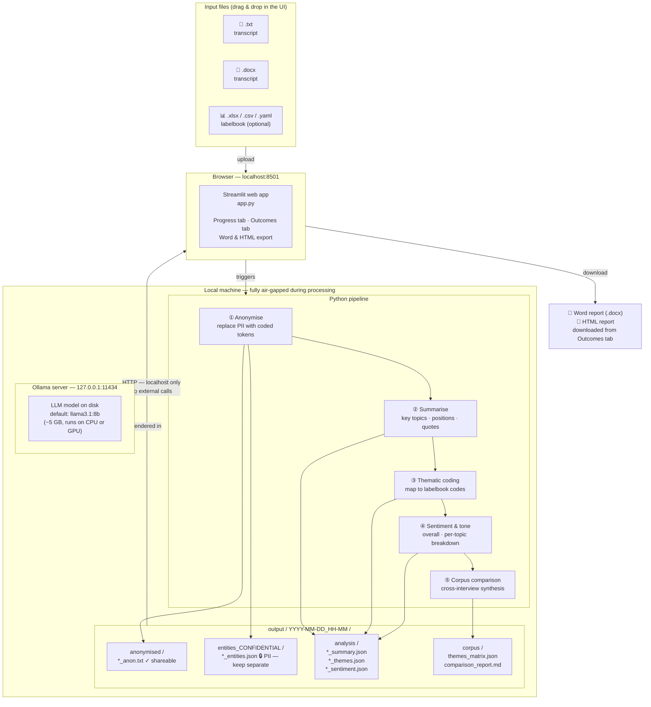

# riecs-interview-coding

Fully offline, GDPR-compliant interview analysis system.  
Transcripts never leave the machine. All inference runs locally via [Ollama](https://ollama.com).

---

## System architecture



### How data flows

| Step | What happens | Where it goes |
|---|---|---|
| Upload | Transcript files copied to a temporary directory | Temp dir (deleted after run) |
| Anonymise | PII replaced with `[PERSON_1]`, `[ORG_2]`, … | `anonymised/*_anon.txt` |
| Entity map | Original values ↔ placeholders | `entities_CONFIDENTIAL/*_entities.json` 🔒 |
| Summarise | Structured JSON: topics, positions, quotes | `analysis/*_summary.json` |
| Themes | Codes mapped to labelbook (or open coding) | `analysis/*_themes.json` |
| Sentiment | Tone, register, per-topic breakdown | `analysis/*_sentiment.json` |
| Corpus | Cross-interview matrix + synthesis narrative | `corpus/` |
| Export | Self-contained Word & HTML reports | Downloaded to your machine |

The entity maps contain original PII and must be stored on an **encrypted, access-controlled volume** separate from the anonymised outputs.

---

## Pipeline stages

### ① Anonymisation
The LLM reads the full transcript and replaces all personally identifiable information (names, organisations, places, phone numbers, emails, identifying dates) with consistent coded placeholders. Long transcripts (> 4,000 words) are processed in overlapping chunks to keep placeholder numbering consistent. Output: `*_anon.txt` + `*_entities.json`.

### ② Structured summary
Produces a JSON object with `interview_id`, `word_count`, `estimated_duration_min`, `key_topics[]`, `main_positions[]`, `notable_quotes[]`, and `methodological_notes`. Validated against `output-schema/interview_result.json`.

### ③ Thematic coding
Maps transcript content to codes. If a labelbook is supplied, the model maps mentions to existing codes and may propose new ones. If no labelbook is provided, it performs open inductive coding. Output includes `code`, `label`, `description`, `frequency`, `supporting_quotes[]`, and `sub_themes[]` per theme.

### ④ Sentiment and tone analysis
Classifies overall tone (positive / neutral / negative / mixed), emotional register (formal / conversational / distressed / …), confidence score, and a per-topic sentiment breakdown with notable passages.

### ⑤ Corpus comparison
Runs once after all interviews are processed. Builds a theme-frequency matrix across interviews, identifies consensus and divergent positions, and writes a synthesis narrative in Markdown.

---

## Requirements

### Operating system
- **macOS** 13 Ventura or later (Apple Silicon strongly recommended)
- **Windows** 10 / 11 (64-bit)

### Hardware tiers

| Tier | Example hardware | Recommended model | Time / interview (medium, ~6 000 words) |
|---|---|---|---|
| 1 — CPU only | Any laptop, 16 GB RAM | `llama3.2:3b` | 7–12 min |
| 2 — Consumer GPU / M2 | RTX 3070 · M2 Pro 18 GB | `llama3.1:8b` | 2–4 min |
| 3 — Pro workstation | RTX 4090 · Mac Studio M2 Max | `llama3.1:8b` | 50 s–2 min |
| **3c — Best value** | **Mac mini M4 Pro 64 GB** | **`llama3.1:70b`** | **4–6.5 min** |
| 4 — Server | 2× RTX 4090 · A100 80 GB | `llama3.1:70b` | 2–3.5 min |

The Mac mini M4 Pro 64 GB (≈ €2,200–2,700) is the recommended production machine: the 70B model fits entirely in unified memory, zero GPU driver complexity, fanless, and runs sustained overnight batches on ~40 W.

See [`00-hardware-scenarios.md`](00-hardware-scenarios.md) for full benchmarks and procurement arguments, and [`Benchmark.md`](Benchmark.md) for measured real-world results on a Mac mini M4 Pro 64 GB.

### Software dependencies

| Dependency | Version | Purpose |
|---|---|---|
| [Ollama](https://ollama.com) | ≥ 0.3 | Local LLM server |
| Python | ≥ 3.11 | Pipeline orchestration |
| `ollama` (Python SDK) | ≥ 0.3.0 | HTTP client to Ollama |
| `pydantic` | ≥ 2.0 | Output schema validation |
| `pyyaml` | ≥ 6.0 | Config file parsing |
| `rich` | ≥ 13.0 | CLI progress display |
| `streamlit` | ≥ 1.35 | Web UI |
| `openpyxl` | ≥ 3.1 | Excel labelbook parsing |
| `python-docx` | ≥ 1.1 | Word transcript reading & report export |
| `matplotlib` | ≥ 3.7 | Theme relevance & co-occurrence charts in reports |

---

## Installation

### macOS

```bash
chmod +x install/install-mac.sh
./install/install-mac.sh
```

Options:

```
--model llama3.1:8b      # which model to pull (default: llama3.1:8b)
--dir ~/interview-analyser  # install directory (default: ~/interview-analyser)
--extra-models           # also pull llama3.2:3b and mistral-small:22b
```

What the script does:
1. Installs [Homebrew](https://brew.sh) if absent
2. Installs Python 3.12 via Homebrew if < 3.11 is found
3. Installs Ollama via Homebrew
4. Sets `OLLAMA_NO_ANALYTICS=1` and `OLLAMA_HOST=127.0.0.1:11434` in `~/.zprofile`
5. Pulls the selected model (may take 5–30 minutes depending on connection speed)
6. Creates a Python virtual environment and installs all dependencies
7. Copies pipeline files, prompts, assets, and config to the install directory
8. Writes `run-ui.sh` and `run-analysis.sh` launcher scripts

### Windows

Run PowerShell **as Administrator**:

```powershell
Set-ExecutionPolicy -Scope Process -ExecutionPolicy Bypass
.\install\install-windows.ps1
```

Options:

```powershell
-Model llama3.1:8b
-InstallDir "$env:USERPROFILE\interview-analyser"
-PullAdditionalModels
-SkipPython
```

What the script does:
1. Checks for Python ≥ 3.11; downloads and installs 3.12 if needed
2. Downloads and installs the Ollama Windows installer silently
3. Sets `OLLAMA_NO_ANALYTICS=1` and `OLLAMA_HOST=127.0.0.1:11434` as machine-wide environment variables
4. Pulls the selected model
5. Creates a Python virtual environment and installs all dependencies
6. Copies pipeline files to the install directory
7. Writes `run-ui.bat` and `run-analysis.bat` launcher scripts

---

## Air-gap transfer (running on a machine without internet)

If the target machine will never have internet access, install everything on a connected machine first, then transfer:

**macOS**
```
1. Copy ~/.ollama/models  →  USB drive
2. On target: brew install ollama  (or copy the binary)
3. Copy USB models back to ~/.ollama/models on target
4. Copy the install directory (~/interview-analyser) across
5. DO NOT run 'ollama pull' on the air-gapped machine
```

**Windows**
```
1. Copy %USERPROFILE%\.ollama\models  →  USB drive
2. On target: install Ollama (OllamaSetup.exe, no pull)
3. Copy USB models back to the same path on target
4. Copy the install directory across
```

Before air-gapping, run the verification script:
```bash
# macOS
python ~/interview-analyser/pipeline/verify.py

# Windows
python %USERPROFILE%\interview-analyser\pipeline\verify.py
```

Then disable all network adapters (Wi-Fi + Ethernet) in System Settings / Device Manager.

---

## Configuration

Edit `config.yaml` in the install directory before running:

```yaml
models:
  anonymise: llama3.1:8b
  summarise:  llama3.1:8b
  themes:     llama3.1:8b   # upgrade to llama3.1:70b for richer coding
  sentiment:  llama3.1:8b
  compare:    llama3.1:8b   # upgrade to llama3.1:70b for better synthesis

ollama:
  host: http://127.0.0.1:11434   # never point to an external host
  timeout_seconds: 300            # increase for slow hardware or very long transcripts

paths:
  interviews: ./interviews        # .txt and .docx transcripts go here (CLI mode)
  output:     ./output

chunking:
  max_words_per_chunk: 4000       # split transcripts longer than this
  overlap_words: 200

analysis:
  language: en
  anonymise_dates: true           # set false to keep relative time references
  min_theme_frequency: 2

gdpr:
  entities_subdir: entities_CONFIDENTIAL
  log_pii: false
  warn_network_path: true
```

Each pipeline stage can use a **different model** — useful for running fast 8B models for anonymisation and structured tasks, then a 70B model only for thematic coding and corpus comparison (where nuance matters most).

---

## Using the web UI

```bash
# macOS
~/interview-analyser/run-ui.sh

# Windows
%USERPROFILE%\interview-analyser\run-ui.bat
```

Then open **http://localhost:8501** in any browser.

**Progress tab**

| Left column | Right column |
|---|---|
| Upload `.txt` or `.docx` transcripts (multiple files) | Live progress bar and step-by-step status log |
| Upload `.xlsx`, `.csv`, or `.yaml` labelbook (optional) | Completes with "Analysis complete" notice |
| Map labelbook columns (auto-detected, adjustable) | |
| Click **Run Analysis** | |

**Outcomes tab** (appears after a run)

- **Download Word report (.docx)** — structured document with executive summary, theme matrix, and per-interview sections; ready to share or print
- **Download HTML report** — self-contained single file; open in any browser and use File › Print › Save as PDF
- **Report highlights** — scrollable pane showing the full content inline: executive summary, theme matrix, and per-interview cards with summary, themes (frequency badges), sentiment, and notable quotes

---

## Using the CLI

```bash
# macOS/Linux
~/interview-analyser/run-analysis.sh

# Windows
%USERPROFILE%\interview-analyser\run-analysis.bat
```

```
usage: main.py [-h] [--interview PATH] [--compare-only] [--run-dir PATH]
               [--stage {anonymise,summarise,themes,sentiment}] [--config PATH]

examples:
  python main.py                            process all .txt files in interviews/
  python main.py --interview my.txt         process a single transcript
  python main.py --stage anonymise          run only anonymisation
  python main.py --compare-only             re-run corpus comparison on an existing run
```

Place `.txt` or `.docx` transcript files in the `interviews/` directory (or pass `--interview` for a single file). The labelbook path can be set in `config.yaml` under `paths.codebook`.

---

## Output directory structure

```
output/
└── 2026-05-14_10-32/          ← timestamped run directory
    ├── anonymised/
    │   ├── interview_001_anon.txt      ← distributable
    │   └── interview_002_anon.txt
    ├── entities_CONFIDENTIAL/         ← contains original PII — keep separate 🔒
    │   ├── interview_001_entities.json
    │   └── interview_002_entities.json
    ├── analysis/
    │   ├── interview_001_summary.json
    │   ├── interview_001_themes.json
    │   ├── interview_001_sentiment.json
    │   ├── interview_002_summary.json
    │   ├── interview_002_themes.json
    │   └── interview_002_sentiment.json
    ├── corpus/
    │   ├── themes_matrix.json          ← cross-interview frequency matrix
    │   └── comparison_report.md        ← synthesis narrative
    └── run_log.jsonl                   ← stage timings and token counts (no PII)
```

---

## GDPR compliance checklist

- [ ] Machine has no Wi-Fi or Ethernet connected during processing
- [ ] `OLLAMA_NO_ANALYTICS=1` is set (the install scripts do this automatically)
- [ ] Ollama is bound to `127.0.0.1` only — confirm `OLLAMA_HOST=127.0.0.1:11434`
- [ ] Output directory is on an **encrypted volume** (BitLocker on Windows / FileVault on macOS)
- [ ] `entities_CONFIDENTIAL/` is stored separately from anonymised outputs, with access controls
- [ ] `run_log.jsonl` reviewed and purged before moving any output off the machine
- [ ] Models were transferred by USB — no `ollama pull` on the air-gapped machine

---

## Repository layout

```
spec/                        ← this repository
├── app.py                   ← Streamlit web UI
├── pipeline/
│   ├── main.py              ← CLI entry point
│   ├── anonymise.py
│   ├── analyse.py           ← summarise, extract_themes, analyse_sentiment
│   ├── compare.py
│   ├── verify.py            ← pre-flight check (run before air-gapping)
│   ├── config.yaml
│   └── requirements.txt
├── prompts/                 ← LLM prompt templates (one per stage)
│   ├── anonymise.txt
│   ├── summary.txt
│   ├── themes.txt
│   ├── sentiment.txt
│   └── compare.txt
├── output-schema/           ← JSON schemas for pipeline output validation
│   ├── interview_result.json
│   └── corpus_result.json
├── assets/
│   ├── riecs-glyph.png
│   └── favicon.ico
├── .streamlit/
│   └── config.toml          ← Streamlit theme (RIECS colours)
├── install/
│   ├── install-mac.sh
│   └── install-windows.ps1
├── 01-architecture.md       ← detailed component spec
├── 00-hardware-scenarios.md ← procurement benchmarks and model selection guide
└── Benchmark.md             ← measured Ollama benchmark (Mac mini M4 Pro 64 GB)
```

---

## Licence

This tool is developed by [RIECS](https://riecs.eu) for internal research use.  
All processing is local. No data is transmitted to any external service.
