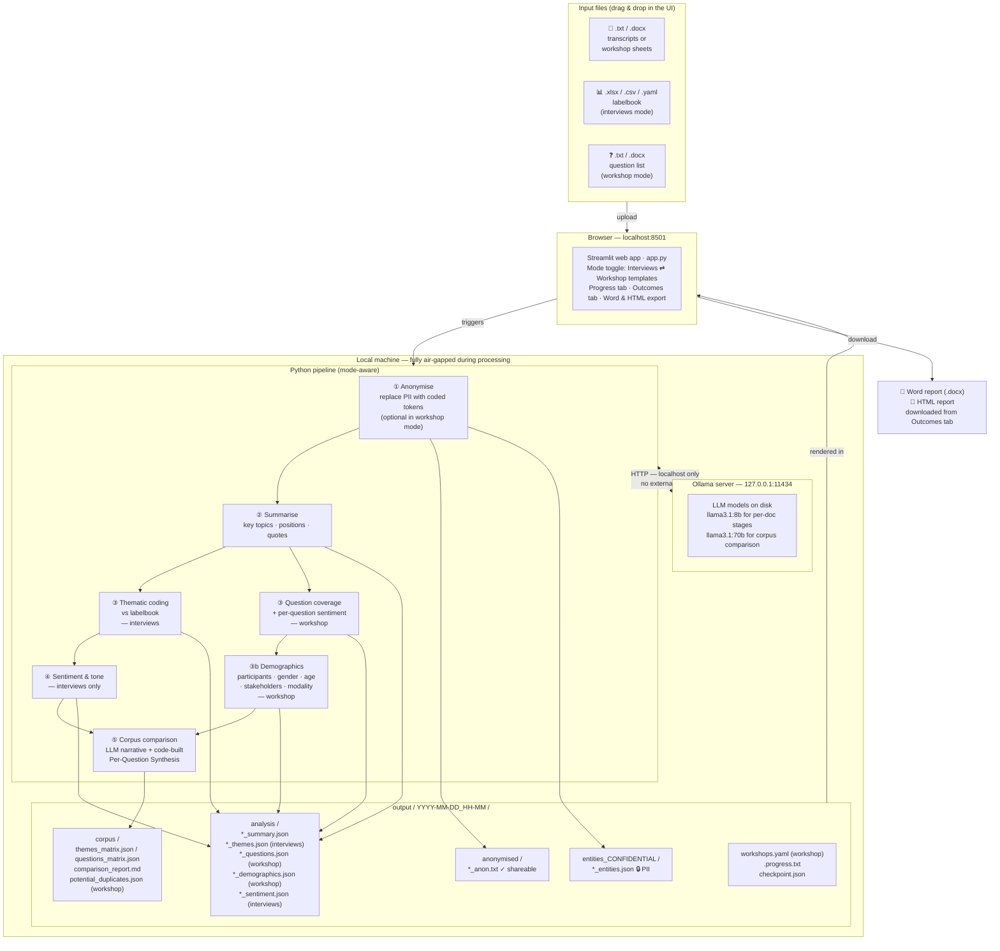

# riecs-interview-coding

Fully offline, GDPR-compliant qualitative analysis system.  
Transcripts and workshop notes never leave the machine. All inference runs locally via [Ollama](https://ollama.com).

The tool runs in one of two modes, switched from the **Analysis mode** toggle at the top of the UI:

- **Interviews** — anonymise → summarise → thematic coding (optionally against a labelbook) → sentiment → cross-interview comparison. Tables and charts are organised by theme.
- **Workshop templates** — anonymise (optional) → summarise → per-question coverage / sentiment / emerging themes → cross-document comparison. Inputs are workshop description sheets plus one or more text/Word files listing research questions; the labelbook block is hidden. Tables and charts are organised by question.

Both modes share Stages 1, 2 and 5 of the pipeline. Mode B replaces thematic coding with a question-driven Stage 3 (`prompts/questions.txt` → `pipeline/questions.py`) and folds sentiment into that same stage.

---

## System architecture



### How data flows

| Step | Interviews mode | Workshop mode | Output |
|---|---|---|---|
| Upload | Transcripts + (optional) labelbook | Workshop sheets + question list | `work/<run>/…` (gitignored) |
| Anonymise | Always | Optional checkbox | `anonymised/*_anon.txt` |
| Entity map | Original values ↔ placeholders | Same | `entities_CONFIDENTIAL/*_entities.json` 🔒 |
| Summarise | Structured JSON | Structured JSON | `analysis/*_summary.json` |
| Stage 3 | Thematic coding (vs labelbook) | Per-question coverage + sentiment + emerging themes | `*_themes.json` / `*_questions.json` |
| Stage 3b (workshop) | — | Demographics extraction | `*_demographics.json` |
| Stage 4 (interviews) | Overall sentiment / register / per-topic tone | folded into stage 3 | `*_sentiment.json` |
| Corpus | Theme matrix + LLM narrative | Question matrix + LLM narrative + **code-built Per-Question Synthesis** | `corpus/` |
| Export | Word + HTML report | Word + HTML report (incl. Demographics + Caveats) | Downloaded |

The entity maps contain original PII and must be stored on an **encrypted, access-controlled volume** separate from the anonymised outputs.

---

## Pipeline stages

### ① Anonymisation
The LLM reads the full transcript and replaces all personally identifiable information (names, organisations, places, phone numbers, emails, identifying dates) with consistent coded placeholders. Long transcripts (> 4,000 words) are processed in overlapping chunks to keep placeholder numbering consistent. Output: `*_anon.txt` + `*_entities.json`. In workshop mode this stage is **optional** (`anonymise_workshop_sheets` checkbox in the UI / config flag).

### ② Structured summary
Produces a JSON object with `interview_id`, `word_count`, `estimated_duration_min`, `key_topics[]`, `main_positions[]`, `notable_quotes[]`, and `methodological_notes`. Validated against `output-schema/interview_result.json`. Shared across both modes.

### ③ Thematic coding (interviews mode)
Maps transcript content to codes. If a labelbook is supplied, the model maps mentions to existing codes and may propose new ones. If no labelbook is provided, it performs open inductive coding. Output includes `code`, `label`, `description`, `frequency`, `supporting_quotes[]`, and `sub_themes[]` per theme.

### ③ Question coverage (workshop mode)
Interrogates each workshop description sheet against the same fixed list of research questions. For every question the LLM returns a per-document record: `coverage` (`answered` / `partially_answered` / `not_answered`), a one-paragraph `answer`, 1–3 verbatim `supporting_quotes`, a per-question `sentiment` (positive / neutral / negative / mixed), and any `emerging_themes` it noticed in passing. Document-level `overall_tone` and `emotional_register` are also recorded — so workshop mode does **not** run a separate Stage 4. Output: `*_questions.json` (schema: `output-schema/workshop_result.json`).

### ③b Demographics extraction (workshop mode)
Pulls structured demographic facts from each sheet — `n_participants`, gender breakdown (Female / Male / Non-binary / Unspecified), `stakeholder_groups[]`, `modality` (`on_site` / `online` / `hybrid` / `unspecified`), and `age_buckets[]` (under_18, 18_24, …, 65_plus). The prompt insists on **null when not stated** — the LLM is never permitted to invent counts. Output: `*_demographics.json` (schema: `output-schema/demographics_result.json`).

### ④ Sentiment and tone analysis (interviews mode only)
Classifies overall tone (positive / neutral / negative / mixed), emotional register (formal / conversational / distressed / …), confidence score, and a per-topic sentiment breakdown with notable passages.

### ⑤ Corpus comparison (both modes)
Runs once after all per-document stages finish. Builds a theme- (interviews) or question- (workshop) frequency matrix across documents, identifies consensus and divergent positions, and writes a synthesis narrative in Markdown.

The compare prompt is hardened against an issue the smaller LLMs exhibit on long structured prompts — confusing the **number of matrix rows** (e.g. 13 questions) with the **number of documents** (e.g. 42 workshops). Two countermeasures:

- **FIXED FACTS block** — the prompt opens with explicit counts (number of source files, distinct workshop IDs, research questions) and instructs the model to copy them verbatim.
- **DOCUMENT REGISTER** — every workshop_id and document_id the model is allowed to cite is listed; "never invent IDs" is in the instructions.

The **Per-Question Synthesis** subsection is not written by the LLM at all in workshop mode — it is built deterministically in `pipeline/compare.py` from the `*_questions.json` files (real quotes, real workshop_ids, real coverage counts) and injected into the report before "Documents With Notable Gaps". See [Workshop mode](#workshop-mode) below for question kinds.

---

## Workshop mode

Switch to **Workshop templates** in the **Analysis mode** toggle at the top of the UI (or pass `--mode workshop` on the CLI). The interviews-mode labelbook is replaced by a list of research questions; the rest of the UI swaps accordingly.

### Workshop IDs and the document register

Each uploaded file gets a stable identifier — `workshop_01`, `workshop_02`, … — assigned in upload order. The mapping is persisted as `<run_dir>/workshops.yaml`, so resumed runs and CLI rerouns keep the same IDs. Workshop IDs appear:

- next to each filename in the right-column progress list,
- as a dedicated column in the Files Evaluated table,
- as the y-axis of the coverage matrix,
- in the DOCUMENT REGISTER block of the compare prompt (so the LLM can only cite real IDs),
- in the in-code Per-Question Synthesis citations.

If the original filenames are dated (e.g. `01102025_WSDT_IBE_Spanish workshop.docx`) the workshop_NN is **not** chronological — the Caveats section calls this out explicitly so readers cross-reference dates from filenames if order matters.

### Potential-duplicate detection

After all per-document stages finish, the UI clusters filenames by **token-set Jaccard similarity** (≥ 0.70 by default) to flag possible duplicates — e.g. `Workshop_5_part_a.docx` and `Workshop_5_part_b.docx`. The normaliser strips stopwords (`workshop`, `draft`, `vN`, common years) and single-letter part markers, and keeps digits because the workshop number is usually the discriminator. Clusters are saved to `corpus/potential_duplicates.json` and fed into the compare prompt as a `{{POTENTIAL_DUPLICATES}}` block; the LLM gets a section instruction to verify each candidate against the per-doc summaries (likely / uncertain / unlikely) without asserting duplication on its own. The same list is rendered in the HTML/DOCX reports as a "Potential Duplicate Workshops" block above the executive summary.

### Question file format

Plain text or Word, one question per non-empty line. Numeric prefixes (`Q1:`, `1.`, `1)`) are stripped. Multiple uploaded files are concatenated in upload order; case-insensitive whitespace-collapsed duplicates are dropped. Mark a corpus-aggregate question with an inline `[aggregate]` token:

```
[aggregate] How many participants from each stakeholder group?
What are the strengths of the workshop method?
How can future workshops be improved?
[aggregate] Age groups per workshop?
```

The parsed list is persisted to `<work>/questions.yaml`:

```yaml
- id: q01
  text: How many participants from each stakeholder group?
  kind: aggregate
- id: q02
  text: What are the strengths of the workshop method?
  kind: per_document
- id: q03
  text: How can future workshops be improved?
  kind: per_document
- id: q04
  text: Age groups per workshop?
  kind: aggregate
  # Optional override of the default Demographics pointer:
  # pointer: "See the Demographics → Age distribution chart."
```

`kind` is honoured by the Per-Question Synthesis renderer:

- **`per_document`** — coverage counts, up to three real answer excerpts (preferring fully answered), sentiment distribution, and a list of documents that didn't address the question.
- **`aggregate`** — a one-line pointer to the Demographics section (or the custom `pointer:` you supply). No paraphrase, no quote — the LLM is not consulted for this question's subsection.

### Stakeholder taxonomy

`stakeholder_taxonomy.yaml` at the project root maps canonical group labels to the alias variants the LLM might extract from messy workshop sheets. For instance:

```yaml
- canonical: Policymakers & government
  aliases:
    - policymakers
    - policy makers
    - policy-makers
    - city administration
    - local government
    - municipality
```

The demographics aggregator (in `app.py`) consults this file before falling back to its lightweight heuristic (lowercase + strip trailing 's'). Unmapped labels keep their original casing. Quote aliases that contain colons (`"others: students"`) so YAML doesn't parse them as `{key: value}` mappings.

### Demographics section in the report

Workshop-mode reports include a **Demographics** section with four sub-blocks:

- **Participants & modality** — per-workshop participant count + on-site/online/hybrid, with a row total.
- **Gender distribution** — per-workshop %F / %M / %NB / %U + N, with a row total.
- **Stakeholder groups** — corpus-wide totals after taxonomy normalisation.
- **Age distribution** — horizontal bar chart of corpus-wide age buckets.

If `*_demographics.json` files don't exist (older runs), the section is omitted.

### Caveats section

A data-driven **Caveats** section sits right after the Executive Summary on workshop reports. It is computed from the run — not a generic disclaimer — and surfaces, e.g.:

- The file count vs distinct-workshop count.
- The percentage of participants with reported gender / age (often well below 100% because the source sheets don't always state it).
- Workshops with `n_participants` null because the description didn't state a count.
- How many filename-similarity clusters were flagged for review.
- The number of workshop × question cells with `not_answered` coverage.
- The model used for each stage (corpus comparison defaults to `llama3.1:70b`).

### Coverage matrix and charts

- **Transposed coverage matrix** — rows = workshop IDs (sorted), columns = `q01..qNN`. Cells use a traffic-light palette: green (`answered`), yellow (`partially_answered`), red (`not_answered`). The cell also carries a glyph (`✓` / `½` / `—`) so the table is legible in print and for colour-blind viewers. A legend and Question key follow the table.
- **Coverage chart** — horizontal bar chart of total coverage score per question, labelled with `q01..qNN` (full text is in the Question key).
- **Co-occurrence diagram** — questions on a ring, edges where they share documents. Node sizes are min/max-normalised to a fixed point² range so corpus size doesn't blow them up, and labels are pushed to a larger radius so they never overlap nodes.

### Loading a previous run

The **Outcomes** tab shows a "Load a previous run" dropdown when no run is active in the current session. Every directory under `output/` that contains `corpus/comparison_report.md` is listed with its mode and document count; clicking **Load** re-hydrates the per-doc JSONs, matrix, report, duplicates list and workshop_id map so the in-app Outcomes view + downloadable reports work exactly as they did for an in-session run.

---

## Requirements

### Operating system
- **macOS** 13 Ventura or later (Apple Silicon strongly recommended)
- **Windows** 10 / 11 (64-bit)

### Hardware tiers

| Tier | Example hardware | Recommended model | Time / interview (medium, ~6 000 words) |
|---|---|---|---|
| 1 — CPU only | Any laptop, 16 GB RAM | `llama3.2:3b` | 7–12 min |
| 2 — Consumer GPU / M2 | RTX 3070 · M2 Pro 18 GB | `llama3.1:8b` | 2–4 min |
| 3 — Pro workstation | RTX 4090 · Mac Studio M2 Max | `llama3.1:8b` | 50 s–2 min |
| **3c — Best value** | **Mac mini M4 Pro 64 GB** | **`llama3.1:70b`** | **4–6.5 min** |
| 4 — Server | 2× RTX 4090 · A100 80 GB | `llama3.1:70b` | 2–3.5 min |

The Mac mini M4 Pro 64 GB (≈ €2,200–2,700) is the recommended production machine: the 70B model fits entirely in unified memory, zero GPU driver complexity, fanless, and runs sustained overnight batches on ~40 W.

See [`00-hardware-scenarios.md`](00-hardware-scenarios.md) for full benchmarks and procurement arguments, and [`Benchmark.md`](Benchmark.md) for measured real-world results on a Mac mini M4 Pro 64 GB.

### Software dependencies

| Dependency | Version | Purpose |
|---|---|---|
| [Ollama](https://ollama.com) | ≥ 0.3 | Local LLM server |
| Python | ≥ 3.11 | Pipeline orchestration |
| `ollama` (Python SDK) | ≥ 0.3.0 | HTTP client to Ollama |
| `pydantic` | ≥ 2.0 | Output schema validation |
| `pyyaml` | ≥ 6.0 | Config file parsing |
| `rich` | ≥ 13.0 | CLI progress display |
| `streamlit` | ≥ 1.35 | Web UI |
| `openpyxl` | ≥ 3.1 | Excel labelbook parsing |
| `python-docx` | ≥ 1.1 | Word transcript reading & report export |
| `matplotlib` | ≥ 3.7 | Theme relevance & co-occurrence charts in reports |

---

## Installation

### macOS

```bash
chmod +x install/install-mac.sh
./install/install-mac.sh
```

Options:

```
--model llama3.1:8b      # which model to pull (default: llama3.1:8b)
--dir ~/interview-analyser  # install directory (default: ~/interview-analyser)
--extra-models           # also pull llama3.2:3b and mistral-small:22b
```

What the script does:
1. Installs [Homebrew](https://brew.sh) if absent
2. Installs Python 3.12 via Homebrew if < 3.11 is found
3. Installs Ollama via Homebrew
4. Sets `OLLAMA_NO_ANALYTICS=1` and `OLLAMA_HOST=127.0.0.1:11434` in `~/.zprofile`
5. Pulls the selected model (may take 5–30 minutes depending on connection speed)
6. Creates a Python virtual environment and installs all dependencies
7. Copies pipeline files, prompts, assets, and config to the install directory
8. Writes `run-ui.sh` and `run-analysis.sh` launcher scripts

### Windows

Run PowerShell **as Administrator**:

```powershell
Set-ExecutionPolicy -Scope Process -ExecutionPolicy Bypass
.\install\install-windows.ps1
```

Options:

```powershell
-Model llama3.1:8b
-InstallDir "$env:USERPROFILE\interview-analyser"
-PullAdditionalModels
-SkipPython
```

What the script does:
1. Checks for Python ≥ 3.11; downloads and installs 3.12 if needed
2. Downloads and installs the Ollama Windows installer silently
3. Sets `OLLAMA_NO_ANALYTICS=1` and `OLLAMA_HOST=127.0.0.1:11434` as machine-wide environment variables
4. Pulls the selected model
5. Creates a Python virtual environment and installs all dependencies
6. Copies pipeline files to the install directory
7. Writes `run-ui.bat` and `run-analysis.bat` launcher scripts

---

## Air-gap transfer (running on a machine without internet)

If the target machine will never have internet access, install everything on a connected machine first, then transfer:

**macOS**
```
1. Copy ~/.ollama/models  →  USB drive
2. On target: brew install ollama  (or copy the binary)
3. Copy USB models back to ~/.ollama/models on target
4. Copy the install directory (~/interview-analyser) across
5. DO NOT run 'ollama pull' on the air-gapped machine
```

**Windows**
```
1. Copy %USERPROFILE%\.ollama\models  →  USB drive
2. On target: install Ollama (OllamaSetup.exe, no pull)
3. Copy USB models back to the same path on target
4. Copy the install directory across
```

Before air-gapping, run the verification script:
```bash
# macOS
python ~/interview-analyser/pipeline/verify.py

# Windows
python %USERPROFILE%\interview-analyser\pipeline\verify.py
```

Then disable all network adapters (Wi-Fi + Ethernet) in System Settings / Device Manager.

---

## Configuration

Edit `config.yaml` in the install directory before running:

```yaml
mode: interviews                  # or 'workshop' — also switchable from the UI

models:
  anonymise:    llama3.1:8b
  summarise:    llama3.1:8b
  themes:       llama3.1:8b       # interviews mode
  questions:    llama3.1:8b       # workshop mode
  sentiment:    llama3.1:8b       # interviews mode
  # Corpus comparison sees the full matrix at once. The 8B model tends to
  # confuse the number of matrix rows with the document count on long
  # prompts; 70B is far better at faithful counting / citation. Revert to
  # llama3.1:8b if 70B is too slow on your hardware.
  compare:      llama3.1:70b

ollama:
  host: http://127.0.0.1:11434   # never point to an external host
  timeout_seconds: 300            # increase for slow hardware or very long transcripts

paths:
  interviews: ./interviews                 # .txt / .docx transcripts (CLI mode, interviews)
  output:     ./output
  codebook:   null                         # path to labelbook.yaml (interviews mode), or null
  questions:  null                         # path to questions.yaml (workshop mode, required)
  stakeholder_taxonomy: ./stakeholder_taxonomy.yaml   # see Workshop mode above

chunking:
  max_words_per_chunk: 4000       # split transcripts longer than this
  overlap_words: 200

analysis:
  language: en
  anonymise_dates: true                    # set false to keep relative time references
  min_theme_frequency: 2                   # interviews mode
  anonymise_workshop_sheets: true          # workshop mode — set false to skip stage 1

gdpr:
  entities_subdir: entities_CONFIDENTIAL
  log_pii: false
  warn_network_path: true
```

Each pipeline stage can use a **different model** — useful for running fast 8B models for anonymisation and structured tasks, then a 70B model only for thematic coding and corpus comparison (where nuance matters most).

---

## Using the web UI

```bash
# macOS
~/interview-analyser/run-ui.sh

# Windows
%USERPROFILE%\interview-analyser\run-ui.bat
```

Then open **http://localhost:8501** in any browser.

The top of the page carries an **Analysis mode** toggle — switching between *Interviews* and *Workshop templates* swaps the left-column blocks. The toggle is disabled while a run is in progress, and a resume button preserves the mode of the original run.

**Progress tab — interviews mode**

| Left column | Right column |
|---|---|
| Upload `.txt` or `.docx` transcripts (multiple files) | Live progress bar with per-stage updates |
| Upload `.xlsx`, `.csv`, or `.yaml` labelbook (optional) | Workshop_NN (workshop mode) next to each filename in the queue |
| Map labelbook columns (auto-detected, adjustable) | "Stop after this document" pauses to a resumable checkpoint |
| Click **Run Analysis** | When done: a "Processing log" expander stays open showing per-stage timings for every document |

**Progress tab — workshop mode**

| Left column | Right column |
|---|---|
| Upload workshop description sheets (`.txt`/`.docx`, multiple) | Same right-column behaviour as interviews mode |
| Upload one or more question files (`.txt`/`.docx`, multiple) | |
| Toggle **Anonymise workshop sheets before analysis** (default ON) | |
| Click **Run Analysis** (disabled until ≥ 1 sheet and ≥ 1 question are parsed) | |

**Outcomes tab** (appears after a run, or via the "Load a previous run" dropdown)

- **Download Word report (.docx)** — structured document with executive summary, caveats, coverage matrix, charts, demographics tables, and per-document sections; ready to share or print
- **Download HTML report** — self-contained single file; open in any browser and use File › Print › Save as PDF
- **Report highlights** — scrollable pane showing the full content inline: executive summary, caveats, coverage matrix, frequency + co-occurrence charts (workshop), demographics (workshop), and per-document cards with summary, themes / questions, and notable quotes
- **Load a previous run** — dropdown when no live run is active; picks up any directory under `output/` that has a finished `corpus/comparison_report.md`

---

## Using the CLI

```bash
# macOS/Linux
~/interview-analyser/run-analysis.sh

# Windows
%USERPROFILE%\interview-analyser\run-analysis.bat
```

```
usage: main.py [-h] [--interview PATH] [--mode {interviews,workshop}]
               [--questions PATH] [--compare-only] [--run-dir PATH]
               [--stage {anonymise,summarise,themes,questions,demographics,sentiment}]
               [--config PATH]

examples:
  # Interviews — process all .txt files in interviews/
  python main.py

  # Single transcript
  python main.py --interview my.txt

  # Workshop mode — full pipeline against a questions file
  python main.py --mode workshop --questions ./questions.yaml

  # Re-run only one stage against an existing run dir (uses the anonymised
  # files already on disk; original raw inputs are not needed):
  python main.py --stage demographics --mode workshop \
    --run-dir output/2026-05-28_11-52

  # Re-run only the corpus comparison (cheap; no per-doc reprocessing):
  python main.py --compare-only --mode workshop \
    --run-dir output/2026-05-28_11-52 \
    --questions output/2026-05-28_11-52/questions.yaml
```

### Live progress for detached / scripted runs

When the CLI is launched detached (no TTY, output redirected to a file) Rich's
in-place progress bar is suppressed. `pipeline/main.py` also writes a one-line
plain-text status to `<run_dir>/.progress.txt` on every ~40-token tick, so
`tail -f` becomes a live progress meter:

```
$ tail -f output/2026-05-28_11-52/.progress.txt
Corpus comparison:  37%  (3,200 tokens · 218s elapsed · est. 10m 08s)
```

Place transcripts (interviews mode) in the `interviews/` directory or pass
`--interview` for a single file. In workshop mode the file glob defaults to
the same path; when `--stage <s>` is supplied together with `--run-dir <d>`,
the CLI iterates over `<d>/anonymised/*_anon.txt` instead — so individual
stages can be re-run after the fact on a UI-created run dir without keeping
the original raw inputs.

---

## Output directory structure

**Interviews mode**

```
output/
└── 2026-05-14_10-32/          ← timestamped run directory
    ├── anonymised/
    │   ├── interview_001_anon.txt      ← distributable
    │   └── interview_002_anon.txt
    ├── entities_CONFIDENTIAL/          ← contains original PII — keep separate 🔒
    │   ├── interview_001_entities.json
    │   └── interview_002_entities.json
    ├── analysis/
    │   ├── interview_001_summary.json
    │   ├── interview_001_themes.json
    │   ├── interview_001_sentiment.json
    │   ├── …
    ├── corpus/
    │   ├── themes_matrix.json          ← cross-interview frequency matrix
    │   └── comparison_report.md        ← synthesis narrative
    ├── checkpoint.json                 ← present only during a partial / resumable run
    ├── .progress.txt                   ← live progress line (tail -f friendly)
    └── run_log.jsonl                   ← stage timings and token counts (no PII)
```

**Workshop mode**

```
output/
└── 2026-05-28_11-52/
    ├── anonymised/                     ← present only if anonymise_workshop_sheets=true
    │   └── workshop_NN_anon.txt
    ├── entities_CONFIDENTIAL/          ← matching entity maps 🔒
    │   └── workshop_NN_entities.json
    ├── analysis/
    │   ├── *_summary.json              ← shared with interviews mode
    │   ├── *_questions.json            ← per-doc question coverage + sentiment + quotes
    │   └── *_demographics.json         ← per-doc demographic facts
    ├── corpus/
    │   ├── questions_matrix.json       ← per-question coverage + sentiment + entries
    │   ├── potential_duplicates.json   ← filename-similarity clusters flagged for review
    │   └── comparison_report.md        ← LLM narrative + code-built Per-Question Synthesis
    ├── workshops.yaml                  ← file_stem → workshop_NN mapping
    ├── questions.yaml                  ← (optional) tagged questions with `kind:` field
    ├── checkpoint.json
    ├── .progress.txt
    └── run_log.jsonl
```

---

## GDPR compliance checklist

- [ ] Machine has no Wi-Fi or Ethernet connected during processing
- [ ] `OLLAMA_NO_ANALYTICS=1` is set (the install scripts do this automatically)
- [ ] Ollama is bound to `127.0.0.1` only — confirm `OLLAMA_HOST=127.0.0.1:11434`
- [ ] Output directory is on an **encrypted volume** (BitLocker on Windows / FileVault on macOS)
- [ ] `entities_CONFIDENTIAL/` is stored separately from anonymised outputs, with access controls
- [ ] `run_log.jsonl` reviewed and purged before moving any output off the machine
- [ ] Models were transferred by USB — no `ollama pull` on the air-gapped machine

---

## Repository layout

```
riecs-interview-coding/                  ← this repository
├── app.py                               ← Streamlit web UI
├── pipeline/
│   ├── main.py                          ← CLI entry point
│   ├── anonymise.py
│   ├── analyse.py                       ← summarise, extract_themes, analyse_sentiment
│   ├── questions.py                     ← workshop stage 3 — analyse_questions
│   ├── demographics.py                  ← workshop stage 3b — extract_demographics
│   ├── compare.py                       ← matrix builders + corpus comparison +
│   │                                       code-built Per-Question Synthesis
│   ├── charts.py                        ← coverage / co-occurrence diagrams
│   ├── timing.py                        ← per-stage time estimates
│   ├── verify.py                        ← pre-flight check (run before air-gapping)
│   ├── config.yaml
│   └── requirements.txt
├── prompts/                             ← LLM prompt templates (one per stage)
│   ├── anonymise.txt
│   ├── summary.txt
│   ├── themes.txt                       ← interviews mode
│   ├── sentiment.txt                    ← interviews mode
│   ├── questions.txt                    ← workshop mode — stage 3
│   ├── demographics.txt                 ← workshop mode — stage 3b
│   ├── compare.txt                      ← corpus comparison — interviews
│   └── compare_workshop.txt             ← corpus comparison — workshop, with
│                                          FIXED FACTS + DOCUMENT REGISTER
├── output-schema/                       ← JSON schemas for pipeline output validation
│   ├── interview_result.json
│   ├── corpus_result.json
│   ├── workshop_result.json             ← per-doc questions stage
│   └── demographics_result.json         ← per-doc demographics stage
├── stakeholder_taxonomy.yaml            ← canonical labels for demographics aggregation
├── assets/
│   ├── riecs-glyph.png
│   └── favicon.ico
├── .streamlit/
│   └── config.toml                      ← Streamlit theme (RIECS colours)
├── install/
│   ├── install-mac.sh
│   └── install-windows.ps1
├── 01-architecture.md                   ← detailed component spec
├── 00-hardware-scenarios.md             ← procurement benchmarks and model selection guide
└── Benchmark.md                         ← measured Ollama benchmark (Mac mini M4 Pro 64 GB)
```

---

## Licence

This tool is developed by [RIECS](https://riecs.eu) for internal research use.  
All processing is local. No data is transmitted to any external service.
